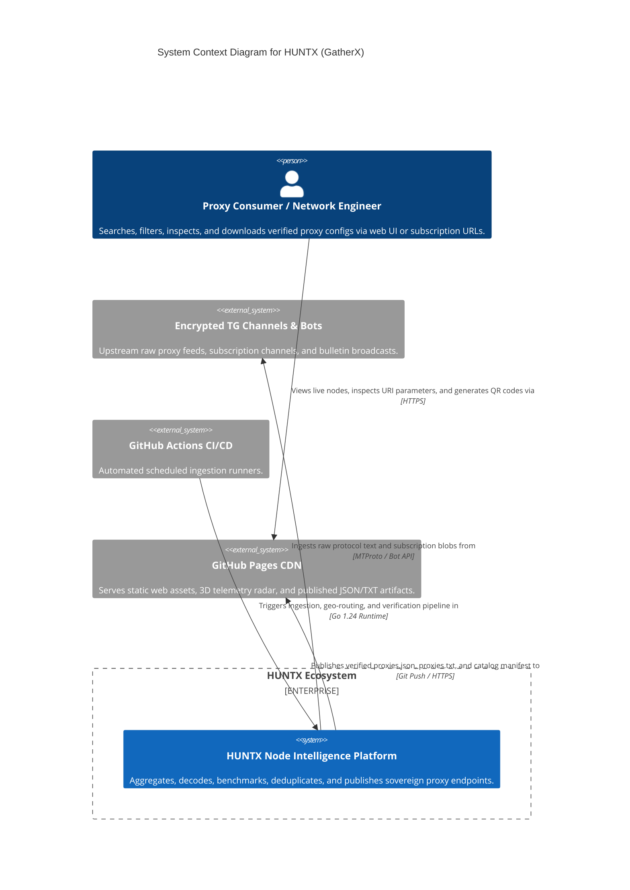

# HUNTX (GatherX) — Cyber Telemetry & Sovereign Ingestion Engine

[](https://github.com/AmirrezaFarnamTaheri/HUNTX/actions)
[](LICENSE)
[](https://github.com/AmirrezaFarnamTaheri/HUNTX)
[](docs/C4_ARCHITECTURE.md)

**HUNTX** (powered by GatherX) is a high-throughput, sovereign proxy configuration aggregation, deduplication, and telemetry intelligence platform. It continuously harvests, sanitizes, and benchmarks proxy endpoints across 49+ encrypted channels, publishing unified SHA-256 verified subscriptions and a zero-dependency interactive 3D WebGL Telemetry Dashboard.

---

## ⚡ Key Capabilities

- **High-Throughput Ingestion Engine (`cmd/huntx-engine`)**: Concurrency-safe Go streaming parser capable of processing thousands of proxy configurations per second.
- **3D Telemetry Radar & Web SPA (`docs/`)**: Zero-dependency, offline-first (`file:///` compliant) cyber dashboard featuring real-time Geo-Radar, client-side protocol decoders, and SVG QR matrix generators.
- **Multi-Protocol Coverage**: Native decoding and normalization for **VLESS Reality**, **VMess (Base64 JSON)**, **Trojan TLS**, **Shadowsocks (SIP002)**, and **Hysteria2 / Hy2**.
- **Cryptographic Deduplication**: Content-addressed SHA-256 fingerprinting prevents configuration duplication across heterogeneous channels.
- **GeoRoute Intelligence (`georoute`)**: Automatic GeoIP/CIDR resolution mapping nodes to ISO-3166 alpha-2 regional telemetry hubs (DE, NL, FI, SG, GB, US, TR, JP).
- **Proactive Node Healing (`healing`)**: Automated failure detection, jitter analysis, and fallback route restoration.
- **CI/CD Zero-Budget Automation**: Fully automated GitHub Actions workflow scheduled every 2 hours with atomic GitHub Pages deployment.

---

## 🏗️ C4 Architecture & System Topology

Detailed C4 diagrams and specifications are available in [`docs/C4_ARCHITECTURE.md`](docs/C4_ARCHITECTURE.md) and the interactive [3D Architecture Map](docs/architecture.html).



---

## 🚀 Quick Start

### 1. Web Dashboard (Offline & GitHub Pages)

Open the dashboard directly in any browser:
```bash
# Option A: Direct double-click offline file
open docs/index.html   # macOS
xdg-open docs/index.html # Linux
start docs/index.html  # Windows

# Option B: Local HTTP server
python -m http.server 8000 --directory docs
```

### 2. Building and Running the Go Engine

```bash
# Clone the repository
git clone https://github.com/AmirrezaFarnamTaheri/HUNTX.git
cd HUNTX

# Run all test suites
go test ./...

# Build the HUNTX ingestion engine binary
go build -o bin/huntx-engine ./cmd/huntx-engine
go build -o bin/huntx-tools ./cmd/huntx-tools
```

### 3. Pipeline Ingestion Execution

```bash
# Run stream parser over raw proxy feeds
./bin/huntx-engine --input data/raw/sources.txt --output docs/artifacts/dev/proxies.json
```

---

## 📂 Repository Structure

```
HUNTX/
├── cmd/
│   ├── huntx-engine/          # High-performance Go ingestion & stream engine
│   │   ├── benchmark/         # TCP/TLS latency & jitter benchmarker
│   │   ├── georoute/          # IP & GeoIP regional classification engine
│   │   ├── healing/           # Proactive node recovery daemon
│   │   ├── internal/parse/    # Protocol grammar parsers (VLESS, VMess, Trojan, SS, Hy2)
│   │   ├── stream/            # Stream tokenizer and payload isolator
│   │   └── main.go            # Engine CLI entrypoint
│   └── huntx-tools/           # Administrative utilities and manifest verifiers
├── docs/                      # GitHub Pages Static Site & Telemetry SPA
│   ├── index.html             # Pre-rendered cyber telemetry dashboard
│   ├── architecture.html      # Interactive 3D isometric system topology map
│   ├── C4_ARCHITECTURE.md     # Formal C4 architecture model document
│   ├── DESIGN.md              # Master UI design tokens & accessibility specification
│   ├── DEVELOPMENT.md         # Developer guide & technical notes
│   ├── USER_GUIDE.md          # Comprehensive user manual & bot commands
│   ├── catalog.json           # SHA-256 verified artifact manifest
│   ├── artifacts/dev/         # Published proxy bundles (JSON, TXT, Base64 Sub)
│   └── assets/js/
│       ├── bundle.js          # CORS-immune standalone single-file bundle
│       ├── app.js             # Reactive UI state controller & ARIA modal manager
│       ├── data.js            # Node dataset, hub coordinates & catalog fallback
│       ├── decoder.js         # Multi-protocol client-side URI parser
│       ├── globe.js           # 3D WebGL Canvas radar engine
│       └── qrcode.js          # Standalone SVG QR code matrix generator
├── configs/                   # Production & development YAML configurations
├── data/                      # Local cache, raw inboxes, and persistent state
└── internal/                  # Shared Go packages (output verification, release manifests)
```

---

## 🛡️ Security & Privacy Model

1. **Client-Side URI Sanitization**: All proxy parameters, query arguments, and node titles are sanitized with `escapeHTML()` prior to DOM rendering, preventing stored and reflected XSS attacks.
2. **Deny-by-Default Ingestion**: Non-proxy media (images, voice notes, APKs, executables) are automatically discarded at the stream boundary.
3. **Redacted Telemetry**: Node passwords, UUIDs, and private keys are never logged or transmitted to third-party analytics services.
4. **Offline Isolation**: The web application functions in full isolation without telemetry beacons, cookies, or remote tracking scripts.

---

## 📜 License

MIT License. See [LICENSE](LICENSE) for details.
