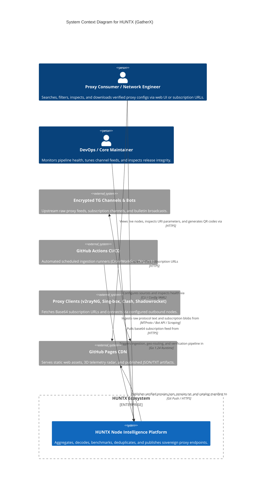
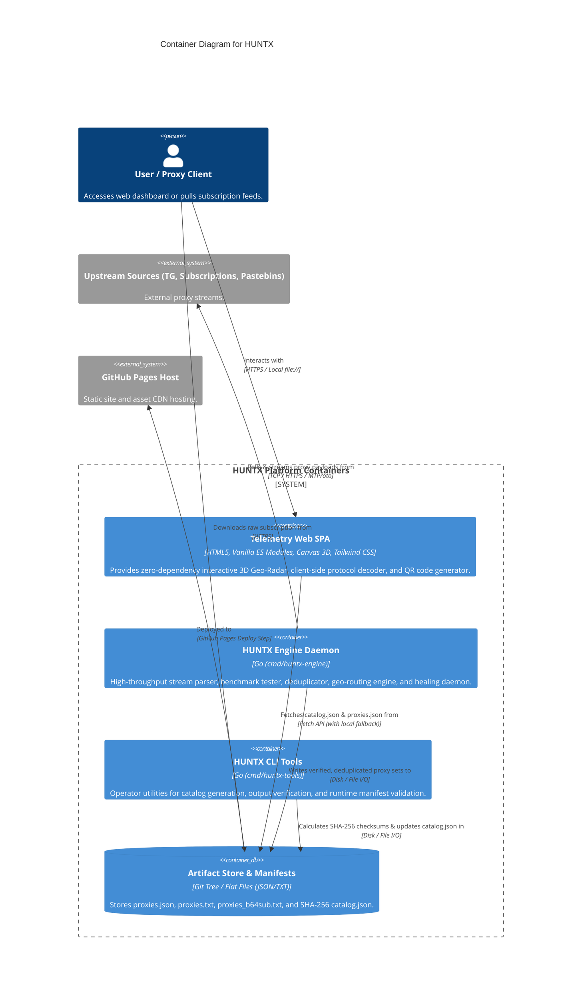
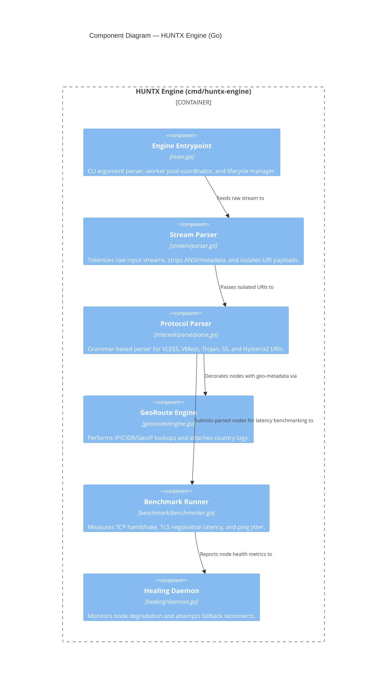
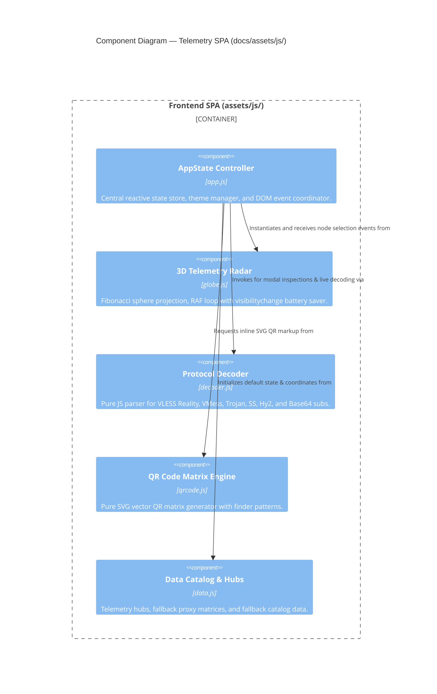
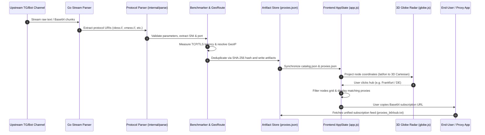

# HUNTX C4 Architecture Specification

This document provides a formal **C4 Model** architectural description of **HUNTX (GatherX)**, covering Context (Level 1), Container (Level 2), Component (Level 3), and Code/Data Flow (Level 4).

---

## 1. Level 1: System Context Diagram

The System Context diagram illustrates how HUNTX interacts with external proxy sources, automated CI/CD runners, and end-user client applications across the open web.

### Personas & Trust Boundaries
- **Proxy Consumer**: Untrusted external client querying the public web UI. Data rendered in the browser is strictly sanitized to prevent XSS.
- **Upstream Channels**: Untrusted external sources. Every ingested URI is treated as malicious until validated, sanitized, and parsed through strict regex/URL grammars.
- **GitHub Actions Runner**: Trusted execution environment executing Go binaries to generate immutable, SHA-256 verified artifact bundles.

---

## 2. Level 2: Container Diagram

The Container diagram zooms into the HUNTX boundary, detailing the runtime units, data stores, and static delivery containers.

### Container Specifications
1. **Frontend Telemetry SPA (`docs/`)**:
   - Zero external runtime dependencies (100% offline and `file:///` compliant).
   - High-performance 2D/3D Canvas engine rendering Fibonacci sphere radar.
   - Client-side decoder supporting VLESS Reality, VMess Base64 JSON, Trojan TLS, Shadowsocks, and Hysteria2.
2. **HUNTX Engine Daemon (`cmd/huntx-engine`)**:
   - Concurrency-safe Go pipeline processing thousands of proxy URIs per second.
   - GeoRoute Engine (`georoute`) mapping IP/domain endpoints to ISO-3166 alpha-2 country codes.
   - Stream Parser (`stream`) with automatic protocol detection and normalization.
   - Healing Daemon (`healing`) for proactive node recovery and dead-node pruning.
3. **Artifact Store (`docs/artifacts/dev/` & `data/artifacts`)**:
   - Flat-file storage model optimized for Git LFS/Pages caching and instant CDN delivery.

---

## 3. Level 3: Component Diagram

### 3.1 Backend: HUNTX Go Engine Components

### 3.2 Frontend: Telemetry SPA Components

---

## 4. Level 4: Code & Data Flow Diagram

The diagram below traces the end-to-end lifecycle of a proxy URI from raw ingest to client rendering:

---

## 5. Architectural Invariants & Quality Attributes

| Attribute | Architectural Decision | Verification Method |
| :--- | :--- | :--- |
| **Zero-Dependency Resilience** | Frontend operates 100% offline with zero CDN dependencies via embedded CSS tokens and vanilla ES modules. | Tested via `file:///` local protocol and browser sandboxing. |
| **XSS Elimination** | All user and proxy-supplied strings are escaped via `escapeHTML()` before DOM injection. | Unit test audit with malformed HTML/JS payloads. |
| **Deduplication Integrity** | Proxies are indexed and deduplicated by SHA-256 fingerprint of normalized configuration parameters. | `internal/outputverify` test suite. |
| **Low-Resource Graphics** | Canvas DPR capped at 2.0; RAF loops pause automatically when `document.hidden == true`. | Profiled under Chromium DevTools Performance tab. |
| **Multi-Platform Support** | Support for VLESS Reality, VMess, Trojan, Shadowsocks, and Hysteria2. | Verified across decoder test suites in Go and Node.js. |
